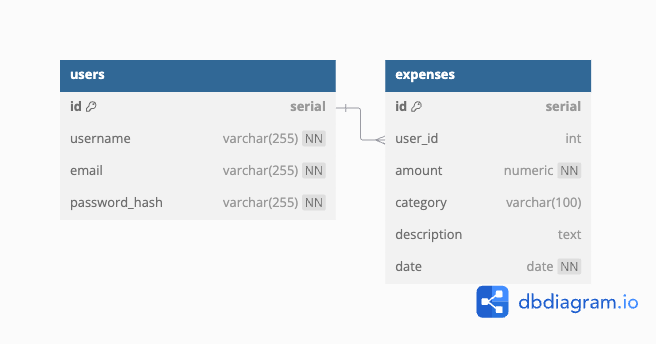

## Overview

Objective: The goal of this project is to design a simple backend system that allows users to add, delete, update, and view expense records. The system will include authentication to ensure that each user can only manage their own data.

Tech Stack:

- Language: Go
- Database: PostgreSQL (integrated using SQLC)
- API: RESTful (Gin framework)
- Authentication: JWT (JSON Web Token)
- Containerization: Docker
- Internal Communication: gRPC

## Database Design

### Tables Structure

The database schema is designed using **SQLC** is used to generate Go code for interacting with the PostgreSQL database.

`Users` Table

| Column        | Type         | Description                   |
| ------------- | ------------ | ----------------------------- |
| id            | Serial       | Primary key                   |
| username      | Varchar(255) | Unique identifier             |
| email         | Varchar(255) | User's email address (unique) |
| password_hash | Varchar(255) | Encrypted passwords           |

`Expenses` Table

| Column      | Type         | Description                                     |
| ----------- | ------------ | ----------------------------------------------- |
| id          | Serial       | Primary key                                     |
| user_id     | Integer      | Foreign key, references `User`                  |
| amount      | Numeric      | Expense amount                                  |
| category    | Varchar(100) | Category of the expense (e.g., food, transport) |
| description | Text         | Brief description of the expense                |
| date        | Date         | Date of the expense                             |

### Data Relationships

One `user` can have multiple` expense` records (1-to-many relationship).
SQL queries will be defined in `.sql` files, and **SQLC** will generate type-safe Go code to interact with the database.

## API design

### User Authentication (Auth API)

| Method | Endpoint  | Description                      |
| ------ | --------- | -------------------------------- |
| POST   | /register | Register a new user              |
| POST   | /login    | Logs in a user and returns a JWT |

### Expense Managment (Expense API)

| Method | Endpoint       | Description                                       |
| ------ | -------------- | ------------------------------------------------- |
| POST   | /expenses      | Creates a new expense record                      |
| GET    | /expenses      | Retrieves all expenses for the authenticated user |
| GET    | /expenses/{id} | Retrieves details of a single expense             |
| PUT    | /expenses/{id} | Updates an existing expense                       |
| DELETE | /expenses/{id} | Deletes an expense                                |

All API requests will use **Gin** framework for routing and middleware,

### JWT Authentication

All API requests must include an `Authorization: Bearer <token>` header for user authentication via JWT.

### Testing and Mocking

The backend system will implement unit tests with high coverage by using **interfaces** and **mocking** for external dependencies such as database and Redis. This ensures that all components are properly tested in isolation. **gomock** can be used for mocking.

## Error Handling

**400 Bad Request**: Invalid request or parameters.

**401 Unauthorized**: Missing or invalid JWT token.

**404 Not Found**: The requested resource does not exist.

**500 Internal Server Error**: Server-side error.

## Security Considerations

**Password Encryption**: Use bcrypt to securely hash user passwords.

**Authentication**: JWT ensures that only authenticated users can access the API.

**SQL Injection Prevention**: Use parameterized queries to prevent SQL injection attacks.

## Deployment and Maintenance

**gRPC**: The app will support **gRPC** for efficient internal communication between microservices if the project scales up.
